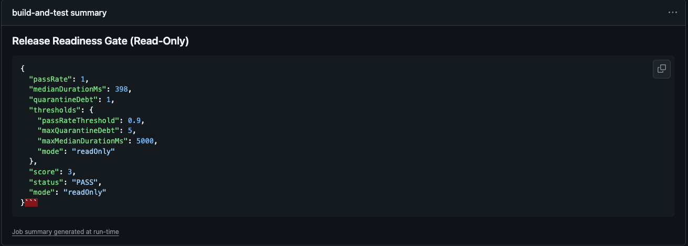

<p align="center">
  
  <br/>
  <em>Cut CI flakiness 40–60% in 30 days • Read-only → Soft → Enforce merge gates</em>
</p>


---

# 🚀 UnflakeOps — Release Readiness in 30 Days

### ❌ The Problem

- Flaky end-to-end tests block merges and waste engineering time.
- Pipelines go red for no reason → reruns + lost trust.
- Gates get bypassed and quality slips.

### ✅ The Solution

A focused **30-day sprint** to make CI predictable:

- **Week 1:** fingerprint failures, quarantine top flakes.
- **Week 2:** deflake top clusters, add always-green API smoke.
- **Week 3:** soft enforce — PASS/WARN/FAIL on PRs, fewer false-reds.
- **Week 4:** enforce gates with dev buy-in + handover.

### 📊 Proof (this repo’s outputs)

- `artifacts/playwright-results.xml` — E2E JUnit
- `artifacts/newman-results.xml` — API smoke JUnit
- `artifacts/fingerprints.json` — clustered failure signatures
- `artifacts/gate-score.json` — PASS/WARN/FAIL gate score

> Target in 30 days: **−40–60% flakiness**, **−30–50% false-red reruns**, gates enforced with confidence.

**👉 Book a 15-min fit call:** https://calendar.app.google/bjFaZCxuQqcZ7PPeA  
**👉 Full overview (one-pager):** <YOUR NOTION LINK>



---

## 🛠 Quickstart (for engineers)

```bash
npm i
npx playwright install --with-deps
npm run ci:all:readonly
```
